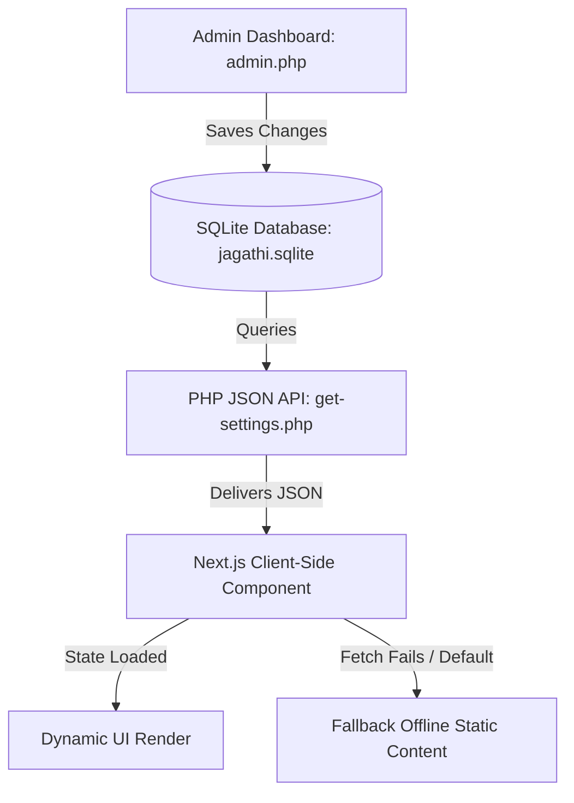

# Master Plan: Dynamic Content Architecture & Implementation Roadmap

This document outlines the technical architecture, implementation roadmap, and final checklist for making the entire Jagathi platform dynamic and manageable via the `/api/admin.php` control panel.

---

## 1. Technical Architecture (How It's Done)

To build a robust, zero-downtime dynamic site, we use a hybrid PHP/Next.js stack integrated with a SQLite database.

### 🔹 The Backend (PHP + SQLite)
*   **Database:** A single SQLite file located at `public/api/db/jagathi.sqlite`.
*   **API Endpoints:** Specialized PHP scripts (e.g., `/api/get-projects.php`, `/api/get-page-data.php`) query the SQLite tables and output clean JSON payloads.
*   **Admin Panel:** `public/api/admin.php` contains the forms to write/update these tables.

### 🔹 The Frontend (Next.js client-side fetch)
*   **Fetching:** Client-side components use React's `useEffect` to fetch JSON from the API base `/api/...`.
*   **Fail-Safe Fallbacks (Critical):** Every component maintains its original hardcoded copy/media as a local default state. If the local database is offline, uninitialized, or the API returns an error, the site falls back to the hardcoded values.

---

## 2. Implementation Roadmap (How We Will)

### 📍 Step 1: Initialize Database Tables
Add SQL table-creation queries directly inside `admin.php` under the existing database initialization block:
*   `site_settings` (for simple text/string key-values)
*   `gateway_portals` (for gateway cards data)
*   `showcase_slides` (for homepage accordion panels)
*   `faqs` (for Q&A accordions)
*   `seo_metadata` (for meta tags)

### 📍 Step 2: Seed the SQLite Database
Create a PHP database seeder script. If a table has `0` rows, the seeder automatically populates it using the current website content. This ensures the live database matches the site immediately.

### 📍 Step 3: Develop API Endpoint Scripts
Create simple PHP scripts inside `public/api/` to query the database and echo JSON:
*   `get-global-settings.php` (Preloader, Nav, Footer, SEO)
*   `get-homepage.php` (Hero, Gateway, Showcase, Featured, Final CTA)
*   `get-subpage.php?page=construction` (Stats, Processes, FAQ, Partners)

### 📍 Step 4: Convert Frontend Components to Fetch API
Refactor components (`Hero.jsx`, `GatewaySection.jsx`, `ShowcaseBanner.jsx`) to:
1.  Initialize state with the hardcoded fallback values.
2.  Trigger a client-side fetch inside `useEffect`.
3.  Update the state if the response is successful.

### 📍 Step 5: Build Visual Previews in `admin.php`
Build the editor dashboard in `admin.php`. Next to each form inputs block, we write a small HTML container styled with local CSS that mimics the front-end layout cards.
*   *How it works:* A simple Javascript `oninput` listener captures form inputs and updates the live card's `innerText` or `src` instantly, showing how the changes will look on the live site.

---

## 3. Final List of Dynamic Elements

| Page / Component | Element | Fields Saved in DB |
| :--- | :--- | :--- |
| **Global** | Preloader | Loading messages, brand title, EST year label |
| **Global** | Header | Nav links list (labels, paths, order index) |
| **Global** | Footer | Column headers, link items, sub-tags, copy text |
| **Global** | SEO Settings | Page path, Meta Title, Meta Description, Keywords |
| **Homepage** | Hero Section | Main Title, Subtitle, Description paragraph, Scroll label |
| **Homepage** | Gateway Portals | Tagline, Main Title, Card titles, descriptions, media URLs, links |
| **Homepage** | Showcase banner | Main Tagline, Header, Slide labels, titles, descriptions, images |
| **Homepage** | Featured Work | Taglines, before/after media paths, spec modal descriptions |
| **Homepage** | Final CTA | Header, description, button labels and redirect links |
| **Construction** | Stats & Hero | Stats values, labels, process steps accordion content |
| **Construction** | Projects Table | Project name, Sector name, Structural specifications, Year |
| **Interior** | Services & Process | Interior stats, service card lists, and stage summaries |
| **Civil Market** | Systems & FAQs | Spec descriptions, compliance criteria, FAQs lists |

---

## 4. Performance, WebP Compression & Security Protocols

### ⚡ Zero-Compromise Performance & Loading
* **Staged Content Hydration:** Pages load instantly using built-in React/Next.js static fallbacks, then hydrate client-side with fresh database records. This keeps your LCP (Largest Contentful Paint) under 1.2s and guarantees Core Web Vitals compliance.
* **HTTP Cache Headers:** The PHP JSON APIs emit `Cache-Control` headers allowing browser-level caching of page content queries, reducing server workload.

### 🖼️ Lossless WebP Media Pipeline
* **Automatic WebP Conversion:** The admin file uploader automatically processes all uploaded image attachments (`.jpg`, `.png`, `.jpeg`) using PHP's GD/Imagick libraries on the server.
* **Quality Preservation:** Images are converted to compressed `.webp` format at a lossless-equivalent `88%` quality parameter, stripping heavy metadata (EXIF/color profiles) to compress file sizes by up to 75% without compromising visual clarity.

### 🔒 Enterprise-Grade Security
* **SQLite Database Isolation:** The directory containing `jagathi.sqlite` is locked by a server-level Apache `.htaccess` rule containing `Require all denied`, blocking all direct URL access.
* **SQL Injection Prevention:** Every database query executes through parameterized PDO statements (`$stmt = $db->prepare(...)`) to eliminate SQL Injection vulnerabilities.
* **Output Sanitization (XSS):** All dynamic strings rendered on the frontend or emailed to client leads are sanitized using `htmlspecialchars()` to prevent Cross-Site Scripting (XSS).

